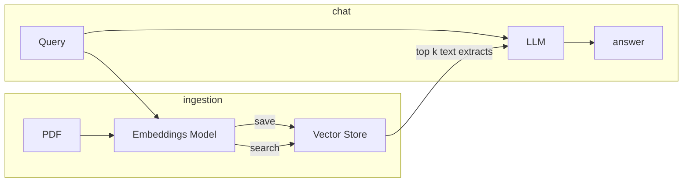

# PDF Assistant

Using llms to chat with pdfs.

### Approach
- [x] Parse the pdfs (Using [pypdf2](https://github.com/py-pdf/pypdf))
- [ ] Improve parsing (Remove headers, footers, page numbers etc)
- [x] Create embeddings of the text chunks using a good embeddings model (Using [intfloat/e5-base-v2](https://huggingface.co/intfloat/e5-base-v2))
- [x] Store the embeddings in a Vector Store (Using [faiss](https://github.com/facebookresearch/faiss))
- [ ] Use the chat history and user question to create a proper question
    - The question must contain all the information needed to answer the question
- [ ] Reflexion, CoT etc
- [x] Embed the proper question
- [x] Compute top-k text chunks from the Vector store
- [x] Use these chunks in the pre prompt of the llm to answer the question (Using [databricks/dolly-v2-3b](https://huggingface.co/databricks/dolly-v2-3b))
- [x] front-end ([Implemented](/chat.py) in [gradio](https://gradio.app/))
- [ ] Show from where the answer was extracted
- [ ] Tune hyperparams, chunk size, top-k, temp etc.
- [ ] Tests
- [ ] Faster inference (ggml, quantization)
- [ ] Better models

Notes:  

The pdf extract is bad. The resulting text contains a lot of noise.

Tuning params would be tricky. What are we optimizing for? **Creating some tests would be nice.** 
Simple examples queries would be fine as test. Observing the system's answers on it would be a good indicator of its performance. 

The model seems to know stuff already like self-attention and gpt. We should consider its 
previous knowledge as information as well, or maybe not. 

In total two models will be used. One for the embeddings and one for text generation.
Can a single Transformer be used?
A transformer does have an encoder that "encodes" the text

Applications
- Research papers
- Financial Docs
- News articles

