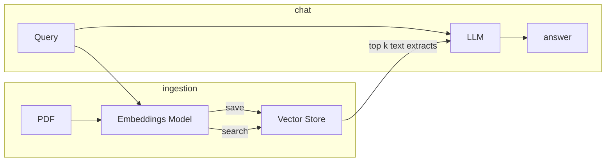

# PDF Assistant

Using llms to chat with pdfs.

### TODO
- [ ] Use llama
- [ ] make better abstractions
  - [ ] Embeddings Model
  - [ ] Vector Store
  - [ ] LLM
- [ ] Better chunking

Notes:  

The pdf extract is bad. The resulting text contains a lot of noise.

Tuning params would be tricky. What are we optimizing for? **Creating some tests would be nice.** 
Simple example queries would be fine as test. Observing the system's answers on it would be a good indicator of its performance. 

The model seems to have its own knowledge that it uses to answer the Qs without the context. We should consider its 
previous knowledge as information as well, or maybe not. 

In total two models will be used. One for the embeddings and one for text generation.
Can a single Transformer be used?
A transformer does have an encoder that "encodes" the text

Applications
- Research papers
- Financial Docs
- News articles

